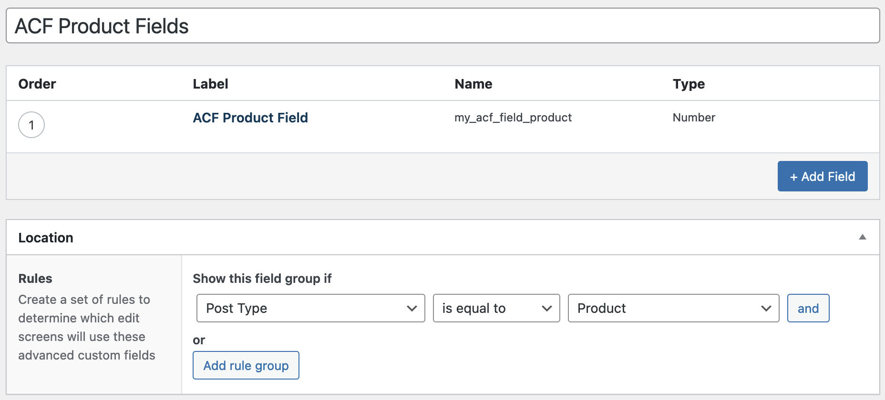
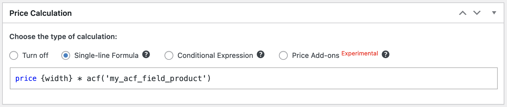

# Use ACF in formulas

WC Kalkulator 1.5.0 adds support for ACF plugin. You can use ACF fields values in formulas.

## Usage

Use `acf('field_name')` to get custom field value of the Product or Fieldset Post Type. If you need to get field value of differend Post Type, use Post ID as second parameter.

If you want to get ACF field value of different Post, just type in Post ID as a second parameter.

For example: use `acf('field_name'; 239)` to get ACF field value of Post with ID = 239.

!!!
Note that arguments are separated by `;`
!!!

This function returns float value of the field. The `acf(name; post_id)` is translated to PHP code `floatval( get_field( $name, $post_id ) );` where `get_field()` is function from the ACF Plugin.