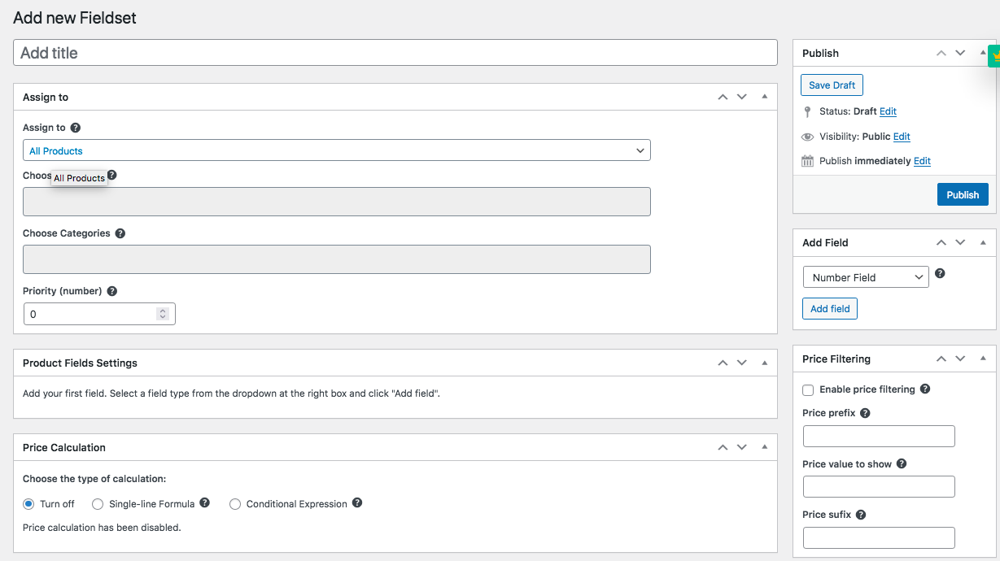
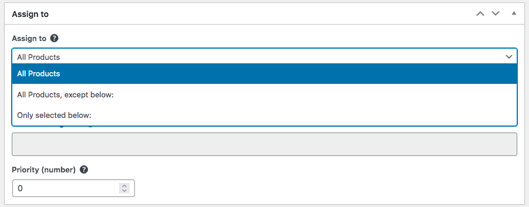
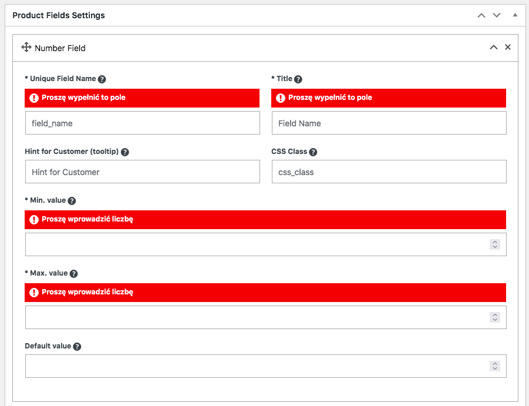
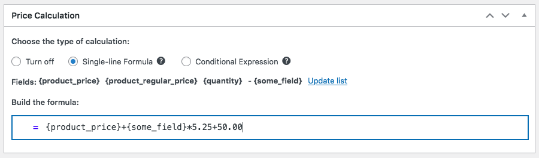
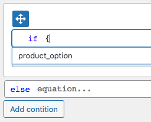

# Usage

Here we explain how to work with the plugin. 
Please read carefully whole page. 
Feel free to contact us if something is not clear.

!!!
Plugin supports Wordpress Multisite feature. Fieldsets are separate for each site.
!!!

## Adding new Fieldset

Navigate to **Products > WCK Fieldsets** in Wordpress dashboard.


Click **Add Fieldset** to create new one. The empty form looks like below:




- **Fieldset Title** is used only in Wordpress dashboard
- **Assign to** - you can assign this fieldset to products, categories or tags. If product has more than one fieldset, you can set priority. 
!!!warning Priority
Higher value have higher priority
!!!
- **Product Fields Settings** - here you set options for each field.
- **Add Field** - click on the button to add the field of selected type.
- **Price Calculation** - here you define the formula/expression to calculate the product price. You can choose single-line or conditional mode.
- **Price Filtering** - this option changes product prices in catalog. For example you can set the product price to: from 99,99 USD/m2

## Defining fields

Fields can be added, deleted and reordered (drag&drop). Parameters of each field are described in the **Field Types** section.


!!!warning
All settings are validated when saving. Fieldset cannot be saved in case of errors. 
!!!


 
**Select** and **Dropdown** field has ability to add, delete, import options. You can choose the default option for the field.

```
Example options to import (each option in new line)
10;option A
20;option B
```

The example below shows the **Select** field with two options with a default option. In this case the first option is default.


## Defining expressions

!!!danger
You are responsible for preparing the correct formula, mathematically and logically correct. Be careful and always test expressions.
The result (the price) has to be a positive number greater than zero. It is validated during the calculation process.
!!!

The Expression can be defined as single-line or conditional.  You can use **Number** and **Select** fields as variables in the formula. You can also use other fields in the expression and predefined variables ``{product_price}``, ``{product_regular_price}``, ``{quantity}``
!!!warning
Some other fields has a price option. For example the text field ``{my_text}`` has price 50,00 USD and is not required.
If the customer fill in this field the price of the field will be 50,00. But if the customer leaves this field empty the price will be 0,00.
It is important if you take ``{my_text}`` in your expression.
!!!
The "=" (equals sign) is the calculated product price. The plugin checks the conditions one by one. If the condition is true, it returns the value of the assigned formula. 

**First option - single-line expression:**



**Second option - conditional expression:**


!!!
Expression builder has simple autocompletion feature. Please click **Update list** to add fields to autocompletion.
When you type the formula, enter "{" sign and you see the list of available fields.

!!!

### Example of conditional expression

First, we have to define two **Number** or **Select** fields named *width* and *height*.
The price of the product can be 100 USD, 200 USD or (300+area*0.05) USD.

